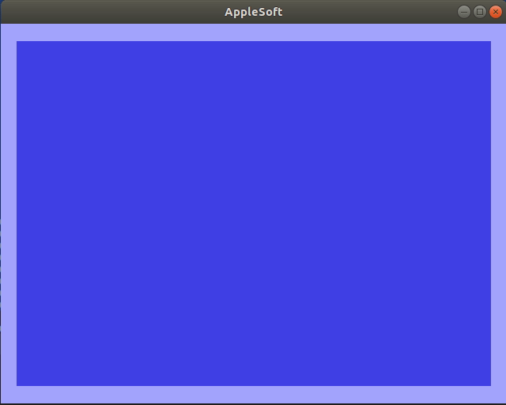

# applesoft_basic
The intention is to make an interpreter and a backend capable of running typical Apple II applications.

### Status:
* No graphics
* A bunch of keywords implemented e.g. THEN, PRINT, LET, REM, LIST, RUN, GOTO, ONERR, LOAD
* Math, most of it anyway (shunting yard and reverse polish notation is hard)
* GUI implemented with LibGDX

